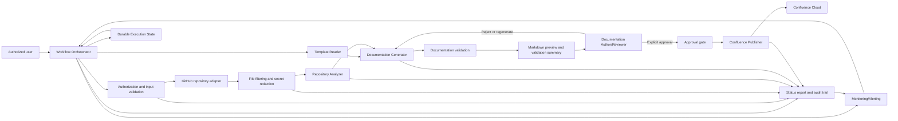

# Automated Documentation Sync Architecture

## 1. System Architecture Overview

Automated Documentation Sync uses a staged agentic pipeline coordinated by a Workflow Orchestrator. It processes explicitly authorized GitHub repositories, reads the mandatory Confluence template, analyzes supported repository evidence, generates a structured Markdown draft, validates it, presents it for explicit reviewer approval, and publishes approved content to Confluence Cloud.

Each repository is processed independently so one repository failure does not stop other repositories in the same execution.



The architecture is limited to behavior supported by `requirements.md`. The following design choices are **Not Defined** by the requirements and must be selected before implementation: LLM provider/model/prompt configuration, exact Confluence representation and parser, validation tooling, persistence technology, queue/orchestration technology, user-interface technology, credential-management product, logging/monitoring platform, retry counts, retention duration, and exact status/audit storage formats.

## 2. Major Components and Responsibilities

### 2.1 Workflow Orchestrator

- Accept requests for one or more explicitly authorized GitHub repositories.
- Create and propagate a unique execution ID.
- Record requesting identity and processing timestamps.
- Coordinate the required processing stages.
- Keep repository processing independent.
- Enforce approval before publishing.
- Aggregate repository statuses, warnings, errors, timestamps, and duration.
- Apply configured concurrency, processing-time, API-call, and resource limits.

The exact orchestration framework and durable state technology are **Not Defined**.

### 2.2 Authorization and Input Validation

- Verify that repositories are explicitly authorized by a Repository Administrator.
- Respect existing repository permissions.
- Validate repository references, branch or commit values, and user/service role context.
- Enforce permissions for the defined roles.
- Treat repository content as untrusted input before it is passed to prompts, tools, or publishing operations.

### 2.3 GitHub Repository Adapter

- Retrieve authorized GitHub repository content and metadata.
- Support the requested branch or commit.
- Provide source files, configuration files, dependency files, README files, and relevant documentation to the analysis boundary.
- Report repository access and network failures.
- Apply configured repository, file, API-call, and processing limits.

The GitHub authentication protocol and client library are **Not Defined** beyond an authenticated connection with appropriate permissions.

### 2.4 File Filtering and Secret Redaction

- Identify supported Java, JavaScript/TypeScript, and Python content.
- Skip unsupported files or languages and record each file and reason.
- Exclude binary, generated, vendor, and irrelevant files where appropriate.
- Validate and sanitize untrusted repository content.
- Detect and redact passwords, API keys, tokens, private keys, credentials, and other secrets before content is included in LLM prompts, logs, intermediate artifacts, errors, or generated documentation.
- Identify required secrets or configuration without exposing their values.

### 2.5 Template Reader

- Read the existing Confluence Cloud template `Technical-App-Manifest-v1`.
- Parse its predefined sections and placeholders.
- Return the template structure and version information to the Documentation Generator.
- Treat template reading and parsing as mandatory.
- Stop the workflow and prevent publishing if the template cannot be read or parsed.

The exact Confluence template representation and parser are **Not Defined**.

### 2.6 Repository Analyzer

The Repository Analyzer receives authorized, filtered, and redacted repository content. It extracts:

- System purpose.
- Architecture and components.
- APIs and interfaces.
- Technology stack and dependencies.
- Setup and installation.
- Configuration without secret values.
- Deployment and infrastructure information.
- Testing information.
- Existing documentation and developer notes.
- Risks and gaps.
- Repository structure and metadata.

It must attach source references where available and report `Not available/Not found in repository` when evidence is absent. It must not infer or fabricate unsupported information.

### 2.7 Documentation Generator

The Documentation Generator combines the parsed template and analyzer findings to:

- Preserve the `Technical-App-Manifest-v1` structure, sections, and placeholders.
- Populate sections only from supported repository evidence.
- Include source references where available.
- Mark missing information explicitly.
- Generate a structured Markdown preview/draft.
- Retain successfully extracted information when other areas are incomplete.

The LLM provider, model, prompt format, and generation implementation are **Not Defined**.

### 2.8 Documentation Validator

The validator checks:

- Required sections.
- Template structure and placeholders.
- Secret redaction.
- Unsupported claims.
- Format compatibility with the required Confluence representation.

It produces a validation summary for the Documentation Author/Reviewer and the approval gate. Exact validation rules and tooling are **Not Defined** beyond these required checks.

### 2.9 Review and Approval Interface

- Present the Markdown preview/draft and validation summary.
- Allow a Documentation Author/Reviewer to view, edit, approve, reject, or request regeneration.
- Record reviewer identity, decision, approval details, and timestamps.
- Prevent rejected or unapproved documentation from publishing.
- Provide status, warnings, errors, review state, and publishing state as required.

The user-interface technology and interaction protocol are **Not Defined**.

### 2.10 Approval Gate

The approval gate releases publishing only when both conditions are true:

1. Explicit reviewer approval exists.
2. Documentation validation succeeds.

No publishing occurs before approval. Rejected documentation returns for correction or regeneration.

### 2.11 Confluence Publisher

- Convert the approved Markdown draft to the required Confluence representation.
- Use the authenticated Confluence Cloud connection.
- Target the `Templates` space.
- Use `Technical-App-Manifest-v1` as the parent page.
- Create a page when no matching page exists.
- Update the existing matching page when one exists.
- Avoid duplicate pages.
- Preserve applicable Confluence access restrictions.
- Record page ID, create/update operation, result, HTTP status, errors, retries, and timestamps.

The exact matching-page key, duplicate-prevention mechanism, Confluence conversion library, and authentication protocol are **Not Defined**.

### 2.12 Status and Audit Store

The status and audit boundary records, without credentials or sensitive content:

- Repository outcome: `Success`, `Partial Success`, `Skipped`, or `Failed`.
- Analyzed and skipped files and languages.
- Extraction, generation, review, and publishing statuses.
- Warnings, errors, start/end timestamps, and processing duration.
- Execution ID.
- Repository metadata and analysis timestamp.
- User/service identity.
- Template version.
- Reviewer and approval details.
- Confluence page ID and create/update operation.
- Publishing results, errors, and retries.

The exact storage technology, schemas, retention duration, and audit format are **Not Defined**.

## 3. Agent Responsibilities and Communication

Agents communicate through execution-scoped structured data. Each exchange should carry the execution ID, repository, branch or commit where available, processing stage, timestamp, and redacted diagnostics.

| Agent | Inputs | Outputs |
| --- | --- | --- |
| Template Reader | Confluence Cloud template reference and execution context | Parsed template sections, placeholders, template version, or a redacted read/parse failure |
| Repository Analyzer | Authorized repository content after filtering and redaction, repository metadata, branch or commit | Structured findings, source references, skipped-file records, missing-value markers, warnings, and extraction status |
| Documentation Generator | Parsed template and analyzer findings | Structured Markdown draft, validation input, warnings, and generation status |
| Documentation Validator | Markdown draft, template structure, analyzer evidence | Validation summary and validation status |
| Confluence Publisher | Approved Markdown draft, successful validation, target space/parent, authenticated connection | Confluence representation, page ID, create/update result, publishing status, HTTP/error details, and retry information |

The contract schema, contract versioning rules, and agent communication mechanism are **Not Defined**. They must preserve execution traceability and must not permit publishing to bypass the approval gate.

## 4. Repository Analysis Flow

1. Receive an explicitly authorized GitHub repository request.
2. Create an execution ID and record identity and timestamp.
3. Verify repository access and collect the requested branch or commit.
4. Retrieve repository metadata and eligible content.
5. Filter unsupported, binary, generated, vendor, and irrelevant content.
6. Record analyzed and skipped files and languages.
7. Redact secrets before repository content reaches prompts, tools, logs, artifacts, errors, or generated documentation.
8. Analyze supported Java, JavaScript/TypeScript, and Python content.
9. Extract the required application and repository information.
10. Attach source references where available.
11. Mark unavailable details as `Not available/Not found in repository`.
12. Return findings, warnings, skipped-content records, metadata, and extraction status.

A repository with no usable content is marked `Unsupported`. Access, authentication, network, or processing failures receive the required repository-level status and do not stop other repositories.

## 5. Documentation Template Processing Flow

1. Request the mandatory `Technical-App-Manifest-v1` template from Confluence Cloud.
2. Read and parse the template sections and placeholders.
3. Record template version and processing status.
4. Stop the workflow and prevent publishing if the template cannot be read or parsed.
5. Pass the parsed template structure to the Documentation Generator.

Template retrieval and parsing behavior beyond the mandatory success/failure outcome is **Not Defined**.

## 6. Documentation Generation Flow

1. Receive the parsed template and sanitized analyzer findings.
2. Map evidence to the template sections and placeholders.
3. Populate only evidence-supported information.
4. Preserve the approved template structure.
5. Include source references where available.
6. Mark unavailable information as `Not available/Not found in repository`.
7. Generate the structured Markdown preview/draft.
8. Generate the validation summary.
9. Present both artifacts to the Documentation Author/Reviewer.
10. On rejection or a regeneration request, correct or regenerate the draft without inventing information.

## 7. Documentation Validation

Validation must occur before approval and before publishing. It must check required sections, placeholders, template structure, secret redaction, unsupported claims, and Confluence format compatibility.

A validation failure prevents approval/publishing and returns the documentation for correction or regeneration. The exact validation rules, severity model, and tooling are **Not Defined**.

## 8. Confluence Synchronization and Publishing Flow

1. Confirm explicit reviewer approval.
2. Confirm successful documentation validation.
3. Convert the approved Markdown draft to the required Confluence representation.
4. Resolve the `Templates` space and `Technical-App-Manifest-v1` parent page.
5. Locate the matching documentation page.
6. Create the page if it does not exist; otherwise update it.
7. Avoid duplicate pages.
8. Preserve Confluence access restrictions.
9. Record page ID, operation, result, HTTP status, errors, retries, and timestamps.

Publishing is triggered automatically only after explicit approval and successful validation. Transient failures use limited exponential-backoff retries. Authentication and permission failures are not repeatedly retried.

The exact page-matching key, concurrency behavior, retry count, retry classification, and ambiguous-response handling are **Not Defined**.

## 9. Data Flow Between Components

```text
Authorized request
  -> Authorization and input validation
  -> GitHub Repository Adapter
  -> File Filtering and Secret Redaction
  -> Repository Analyzer
  -> Template Reader
  -> Documentation Generator
  -> Documentation Validator
  -> Markdown preview and validation summary
  -> Reviewer approval or rejection
  -> Approval gate
  -> Confluence Publisher
  -> Status report and audit trail
```

Status and audit events are produced throughout the flow. Each repository retains an independent outcome, and the execution ID connects repository analysis, generation, review, and publishing records.

## 10. External Systems and Integrations

### GitHub

Provides authorized repository access, repository metadata, branch/commit selection, and source content. GitHub availability, rate limits, and API behavior are external dependencies.

### Confluence Cloud

Provides the mandatory template and receives approved generated documentation in the `Templates` space under `Technical-App-Manifest-v1`. It requires an authenticated API connection with appropriate permissions.

### LLM or Agent Runtime

May support repository interpretation and documentation generation. The provider, model, prompts, data-processing terms, and configuration are **Not Defined**. Repository content must be sanitized and secrets redacted before use.

### Credential and Secret Management

Credentials must be stored through an approved secure mechanism. The selected product or service is **Not Defined**.

## 11. Technology Choices and Rationale

GitHub and Confluence Cloud integrations are required. The implementation technology for the service runtime, HTTP layer, API clients, persistence, queues, workflow orchestration, review interface, validation, secret management, observability, and Confluence conversion is **Not Defined** by `requirements.md` and must not be selected solely from this document.

## 12. Error Handling and Failure Flow

| Failure | Required behavior |
| --- | --- |
| Inaccessible repository | Detect access/authentication/network errors, record a redacted reason, mark `Failed` or `Blocked`, and continue other repositories. |
| Unsupported files/languages | Skip and record file/reason; continue supported analysis. |
| No usable content | Mark the repository `Unsupported`. |
| Template read/parse failure | Stop the workflow and do not publish. |
| Incomplete information | Continue generation and mark unavailable values explicitly. |
| Documentation-generation failure | Retain successful extraction, record the error, mark generation `Failed`, and prevent publishing. |
| Confluence publishing failure | Capture HTTP status and redacted error details; retry transient failures with limited exponential backoff; do not repeatedly retry authentication/permission failures. |
| Security failure | Fail securely without exposing credentials or sensitive implementation details. |
| Failure in one repository | Continue processing other repositories. |

Handling for validation conversion failure, reviewer timeout, persistence failure, process interruption, resource-limit violations, malformed agent output, and ambiguous Confluence responses is **Not Defined** by the requirements.

## 13. Security Considerations

- Process only explicitly authorized repositories.
- Respect repository permissions and use least-privilege GitHub and Confluence identities.
- Store GitHub, Confluence, MCP, and other credentials in an approved secure secret-management mechanism.
- Never hard-code or commit credentials.
- Detect and redact secrets before prompts, logs, intermediate artifacts, errors, or generated documentation.
- Treat repository files as untrusted input and validate/sanitize them before use.
- Use HTTPS/TLS for data in transit and encryption at rest for sensitive stored data where supported.
- Treat generated documentation as potentially confidential.
- Publish only to the authorized Confluence space and preserve applicable access restrictions.
- Do not send repository content or generated documentation to unauthorized third-party services.
- Retain data and logs only for the required period and securely remove temporary data.
- Keep audit records free of credentials and sensitive content.

## 14. Logging and Audit Considerations

Structured logs and audit records must support execution traceability and contain the required identity, repository, stage, timestamp, status, warning, error, retry, review, generation, and Confluence publishing information.

Audit records must include the user/service identity, repository, processing timestamps, template version, generation result, reviewer/approval details, Confluence page ID, create/update operation, publishing result, errors, and retries.

Credentials and sensitive content must be excluded. Log schema, audit schema, monitoring platform, retention duration, and alert destinations are **Not Defined**.

## 15. Scalability and Maintainability Considerations

- Support at least five repositories concurrently initially.
- Make concurrency configurable for future scaling.
- Isolate repository failures.
- Apply configurable CPU, memory, storage, API-rate, file-size, and processing-time limits.
- Keep the four required agents separated by responsibility and independently testable.
- Use integration boundaries for GitHub and Confluence so their external behavior is isolated.
- Preserve shared execution IDs and status structures across all stages.
- Keep template reading, repository analysis, generation, validation, review, and publishing as distinct workflow stages.

The queueing model, deployment topology, persistence scaling strategy, and horizontal-scaling mechanism are **Not Defined**.

## 16. Requirements Traceability

| Architecture area | Requirement traceability |
| --- | --- |
| Authorized intake, execution ID, branch/commit, limits | FR-1.1 to FR-1.5; AC-1; AC-13 |
| Repository analysis and missing information | FR-2.1 to FR-2.2; AC-2 |
| Filtering and secret redaction | FR-3.1 to FR-3.3; SEC-1 to SEC-2; AC-3 to AC-4 |
| Template reading and Markdown generation | FR-4.1 to FR-4.7; AC-5 to AC-6 |
| Review and approval | FR-5.1 to FR-5.4; AC-6 to AC-7 |
| Confluence create/update publishing | FR-6.1 to FR-6.7; AC-7 to AC-8; AC-10 |
| Status, metadata, and audit | FR-7.1 to FR-8.1; SEC-3; AC-9; AC-12 |
| Error handling and repository isolation | ERR-1 to ERR-8; AC-9 to AC-11 |
| Security and privacy | SEC-4 to SEC-11; AC-3; AC-12 |
| Performance, reliability, usability, compatibility, observability | NFR-1 to NFR-20; AC-6; AC-10 to AC-13 |

## 17. Explicit Undefined Decisions

The following are intentionally not selected because they are not established in `requirements.md`:

- LLM provider, model, prompt format, and agent runtime.
- Exact Confluence storage representation and conversion/parser technology.
- Exact documentation validation rules, tooling, and severity model.
- Confluence matching key, duplicate-prevention mechanism, and concurrency control.
- Persistence, queue, and workflow-orchestration technologies.
- Review interface and user-interface technology.
- Credential/secret-management product.
- Log, metric, monitoring, and alerting platforms.
- Retry count, retry classification details, and ambiguous-response handling.
- Retention duration and exact status/audit schemas.
- Handling for validation conversion failure, reviewer timeout, persistence failure, process interruption, resource-limit violations, and malformed agent output.
