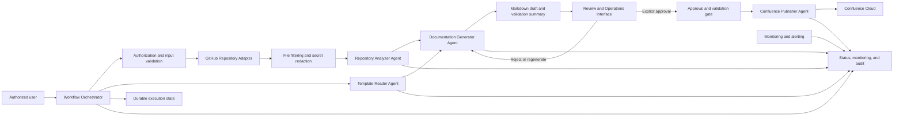

# Automated Documentation Sync Architecture

## 1. Architectural Overview

Automated Documentation Sync is an agentic, staged workflow coordinated by an orchestration layer. It processes explicitly authorized GitHub repositories, reads the mandatory Confluence template, analyzes supported repository content, generates a structured Markdown draft, waits for explicit reviewer approval, converts the approved draft to the required Confluence representation, and synchronizes it to Confluence Cloud.

The architecture separates repository analysis, template handling, documentation generation, review, and publishing. Each repository has an independent processing state so that one repository failure does not stop other repositories in the same execution.

## 2. System Components

### 2.1 Workflow Orchestrator

The Workflow Orchestrator owns execution lifecycle and coordination. It shall:

- Accept requests for one or more explicitly authorized GitHub repositories.
- Create and propagate a unique execution ID.
- Record the requesting identity and processing timestamps.
- Coordinate independent repository jobs and preserve failure isolation.
- Enforce stage timeouts, processing limits, and configured concurrency.
- Prevent publishing until explicit reviewer approval and successful validation.
- Enforce role-based access and approval state transitions.
- Schedule repository jobs with bounded concurrency, backpressure, cancellation, and per-job resource limits.
- Resume or safely reconcile interrupted stages from durable execution state.
- Aggregate status, warnings, errors, metrics, and audit events.

### 2.2 Authorization and Input Validation

This boundary verifies that repositories are explicitly authorized and that the request contains a valid repository reference and branch or commit where provided. It enforces RBAC for repository selection, review, approval, publishing, administration, and audit access. It also treats repository content as untrusted input and applies validation before content is passed to agents or external operations.

### 2.3 GitHub Repository Adapter

The adapter retrieves authorized GitHub repository content and repository metadata at the requested branch or commit. It is responsible for GitHub authentication through externally managed credentials, access/error reporting, and honoring repository and API limits.

### 2.4 File Filtering and Secret Redaction

This boundary identifies supported content and excludes binary, generated, vendor, and irrelevant files where appropriate. It records skipped files and reasons. It detects and redacts passwords, API keys, tokens, private keys, credentials, and other secrets before repository content is included in LLM prompts, logs, intermediate artifacts, errors, or generated documentation.

### 2.5 Template Reader Agent

The Template Reader is the mandatory source of the approved documentation structure. It reads and parses the `Technical-App-Manifest-v1` template from Confluence Cloud and produces a normalized template model for downstream generation.

If the template cannot be read or parsed, the orchestrator stops the workflow and prevents publishing.

### 2.6 Repository Analyzer Agent

The Repository Analyzer examines sanitized, eligible repository content and extracts application and repository information. It supports Java, JavaScript/TypeScript, and Python projects and produces structured findings for:

- System purpose.
- Architecture and components.
- APIs and interfaces.
- Technology stack and dependencies.
- Setup and installation.
- Configuration without secret values.
- Deployment and CI/CD information.
- Testing.
- Existing documentation.
- Risks and gaps.
- Repository metadata and source references.

The agent reports `Not available/Not found in repository` when evidence is absent and must not invent unsupported details.

### 2.7 Documentation Generator Agent

The Documentation Generator combines the normalized template model with analyzer findings. It produces a structured Markdown preview/draft that preserves the template sections, placeholders, and required coverage. It also produces a validation summary covering required sections, placeholders, secret redaction, unsupported claims, and format compatibility.

The generator retains successful findings when other extraction areas are incomplete. A generation failure is recorded and prevents publishing.

### 2.8 Review and Approval Gate

The review boundary presents the Markdown draft and validation summary to a Documentation Author/Reviewer. The reviewer may edit, approve, reject, or request regeneration. Rejected content returns for correction or regeneration and is never published.

The gate records reviewer identity, decision, timestamp, and approval details. Only explicit approval followed by successful validation can release the publishing step.

### 2.9 Confluence Publisher Agent

The Confluence Publisher converts the approved Markdown draft to the required Confluence representation and synchronizes it to Confluence Cloud. It targets the `Templates` space under the `Technical-App-Manifest-v1` parent page. It creates a page when no matching page exists and updates the existing matching page to avoid duplicates.

The publisher records the Confluence page ID, create/update operation, publishing result, HTTP status where applicable, errors, and retries.

### 2.10 Status, Observability, and Audit Store

This component records structured status and audit data without credentials or sensitive content. It supports:

- Repository outcome: `Success`, `Partial Success`, `Skipped`, or `Failed`.
- Analyzed and skipped files and languages.
- Extraction, generation, review, and publishing status.
- Warnings, redacted errors, timestamps, and processing duration.
- Execution IDs, repository/file counts, retries, and Confluence results.
- User/service identity, template version, reviewer decision, page ID, and create/update operation.

### 2.11 Review and Operations Interface

This user-facing interface presents Markdown drafts, validation summaries, progress, warnings, errors, review state, and publishing state. It allows an authorized Documentation Author/Reviewer to edit, approve, reject, or request regeneration. It applies role checks and records reviewer identity, decision, timestamp, and approval details. Read-only status and audit views are available to the Read-Only Auditor according to the defined permissions.

### 2.12 Durable Execution State

This component persists execution and repository stage state, including authorization, template reading, analysis, generation, review, validation, and publishing. State transitions are associated with the execution ID and persisted before dependent stages proceed. Recovery resumes safe incomplete work or reconciles ambiguous external operations before retrying; an interrupted execution cannot bypass approval.

### 2.13 Monitoring and Alerting

This component evaluates structured events and metrics to detect failed or slow jobs, repeated API failures, authentication problems, resource-limit violations, and publishing failures. It exposes operational alerts and status indicators while keeping audit records separate from operational metrics where retention or access requirements differ.

## 3. Agent Communication Contracts

Agents communicate through versioned, schema-validated, execution-scoped messages. Each message carries the execution ID, repository identifier, branch or commit, stage, timestamp, and redacted diagnostics where applicable. Invalid or unsupported messages are rejected, recorded as contract-validation failures, and not passed downstream.

| Agent | Inputs | Outputs |
| --- | --- | --- |
| Template Reader | Confluence Cloud template reference, template version, execution context | Parsed template model, section and placeholder definitions, template metadata, or a redacted template-read/parse error |
| Repository Analyzer | Authorized repository content after filtering and redaction, repository metadata, branch or commit, execution context | Structured extraction findings, source references, skipped-file records, missing-value markers, repository metadata, warnings, and analysis status |
| Documentation Generator | Parsed template model, analyzer findings, source references, execution context | Structured Markdown draft, validation summary, generation warnings/errors, and generation status |
| Confluence Publisher | Approved Markdown draft, validation result, target space and parent page, authenticated Confluence connection, execution context | Confluence representation, page ID, create/update result, publishing status, HTTP/error details, and retry records |

The orchestrator passes outputs between agents and does not allow an agent to bypass the approval and validation gate. Sanitization and redaction occur before model, tool, persistence, logging, or external-service input boundaries. Contract versions are recorded with stage results.

## 4. End-to-End Data Flow

1. A Repository Administrator selects and authorizes one or more GitHub repositories.
2. The orchestrator creates an execution ID and records the requesting identity and start time.
3. The GitHub adapter verifies access and retrieves the requested repository reference.
4. File filtering excludes unsupported or irrelevant content and records skipped items.
5. Secret detection redacts sensitive values before sanitized content is available to agents or logs.
6. The Template Reader reads and parses `Technical-App-Manifest-v1`. A failure stops the workflow and prevents publishing.
7. The Repository Analyzer extracts supported application and repository information.
8. The Documentation Generator applies findings to the template and creates the Markdown draft and validation summary.
9. The Documentation Author/Reviewer reviews the draft, edits it if needed, and either rejects/regenerates or explicitly approves it.
10. The validation gate confirms approval and successful validation.
11. The Confluence Publisher converts the approved Markdown and creates or updates the target page.
12. The orchestrator records status and audit events throughout the flow and closes the execution with duration and repository outcomes.

For interrupted executions, the orchestrator reloads durable state, verifies the last completed transition, and resumes only from a safe state. Before retrying a publisher operation with an unknown result, it reconciles the target page to avoid duplicate creation.

## 5. Repository Analysis Flow

The Repository Analyzer follows this sequence:

1. Confirm repository authorization and branch/commit context.
2. Enumerate repository structure and identify source, configuration, dependency, README, documentation, build, deployment, and test files.
3. Exclude binary, generated, vendor, irrelevant, and unsupported content according to configured limits.
4. Record every skipped file or language and the reason.
5. Detect and redact secrets before analysis content crosses an LLM, logging, artifact, or external-service boundary.
6. Analyze supported Java, JavaScript/TypeScript, and Python content.
7. Extract the required purpose, architecture, API, technology, setup, configuration, deployment, testing, documentation, risk, and metadata findings.
8. Attach source references where available.
9. Mark missing information as `Not available/Not found in repository`.
10. Return findings, warnings, skipped-content records, and an extraction status to the orchestrator.

Repository size, file-count, file-size, API-call, CPU, memory, storage, and processing-time limits are configurable. The orchestrator or resource-policy boundary records limit violations, exposes them in status, cleans up temporary data, assigns the required repository-level outcome, and continues other repository jobs. A repository with no usable content is reported as `Unsupported`; access and processing failures receive the required repository-level status.

## 6. Documentation Generation Flow

The Documentation Generator receives two controlled inputs: the parsed approved template and sanitized analyzer findings.

1. Match findings to the template's predefined sections and placeholders.
2. Populate supported information with source references where available.
3. Preserve the `Technical-App-Manifest-v1` structure.
4. Mark unavailable information explicitly instead of guessing.
5. Produce a structured Markdown preview/draft.
6. Produce a validation summary for required sections, placeholders, secret redaction, unsupported claims, and format compatibility.
7. Send both artifacts to the Documentation Author/Reviewer.
8. On rejection or a regeneration request, retain usable findings and generate a corrected draft.
9. On explicit approval, run the final validation gate before publishing.

The draft is the review artifact. It is converted to the required Confluence representation only after approval and successful validation.

Validation failure blocks approval and publishing, records the validation result, and returns the draft for correction or regeneration. Reviewer timeout or unavailability leaves the draft pending and does not publish it.

## 7. Confluence Synchronization Flow

The Confluence Publisher uses an authenticated, least-privilege Confluence Cloud connection with read/write permissions required for the template and target pages.

1. Confirm the reviewer approval and successful validation result.
2. Convert the approved Markdown draft to the required Confluence representation.
3. Resolve the authorized `Templates` space and `Technical-App-Manifest-v1` parent page.
4. Locate the matching documentation page using a deterministic repository identity and target hierarchy key.
5. Acquire the configured uniqueness/concurrency control for the target identity.
6. Reconcile the target page before mutation, especially after an ambiguous prior response.
7. Create the page when no matching page exists; otherwise update the existing page.
8. Preserve the authorized Confluence access restrictions.
9. Record page ID, create/update operation, publishing result, HTTP status, errors, retries, and completion time.

Publishing is triggered automatically only after explicit approval and successful validation. No publishing occurs before approval. Conversion or validation failure blocks publishing. Transient failures use stage-specific, bounded retries with exponential backoff; authentication and permission failures are not repeatedly retried. Create/update operations must be idempotent or reconciled before retry.

## 8. Error Handling and Failure Isolation

Errors are structured, redacted, execution-scoped, and associated with the affected repository and stage.

| Failure | Behavior |
| --- | --- |
| Inaccessible repository | Record a redacted access, authentication, or network reason; mark the repository `Failed` or `Blocked`; continue other repositories. |
| Unsupported files or languages | Skip and record the file/language and reason; continue supported analysis. |
| No usable repository content | Mark the repository `Unsupported`. |
| Template read or parse failure | Stop the workflow and prevent publishing. |
| Incomplete repository information | Continue generation and mark the value `Not available/Not found in repository`. |
| Documentation-generation failure | Retain successful extraction, record the error, mark generation `Failed`, and prevent publishing. |
| Markdown-to-Confluence conversion failure | Record a redacted error, mark publishing as `Failed`, retain the approved Markdown draft, and prevent the Confluence operation. |
| Final validation failure | Record validation errors, keep publishing blocked, and return the draft for correction or regeneration. |
| Confluence failure | Capture redacted HTTP/error details; retry transient failures with bounded exponential backoff; do not loop on authentication or permission failures. |
| Reviewer unavailable or review timeout | Keep the draft pending, record the status, and do not publish. |
| Status or audit persistence failure | Record the failure where possible, block dependent publishing or state transitions, and fail securely rather than proceeding without required traceability. |
| Orchestrator interruption | Recover from durable state, reconcile ambiguous external operations, and resume only from a safe state. |
| Invalid agent output | Reject the output, record a contract-validation failure, and prevent downstream processing. |
| Resource-limit violation | Record the violated limit, clean up temporary data, assign the configured repository outcome, and continue other jobs. |
| Security failure | Fail securely without exposing credentials or sensitive implementation details. |
| One repository failure in a batch | Isolate the repository job and continue processing other repositories. |

## 9. Security Considerations

- Process only explicitly authorized repositories and respect existing repository permissions.
- Use least-privilege identities for GitHub and Confluence operations.
- Store credentials in an approved secure secret-management mechanism; never hard-code or commit them.
- Detect and redact secrets before repository content is included in LLM prompts, logs, intermediate artifacts, errors, generated documentation, tools, or publishing operations.
- Apply the same redaction and sensitive-content policy to source references, stored drafts, reviewer edits, status reports, audit records, and Confluence payloads.
- Treat repository files as untrusted input and validate/sanitize content before use.
- Use HTTPS/TLS for data in transit and encryption at rest for sensitive stored data where supported.
- Treat generated documentation as potentially confidential and publish only to the authorized Confluence space and page hierarchy.
- Do not send repository content or generated documentation to unauthorized third-party services.
- Retain repository data, intermediate artifacts, and logs only for the required period and securely remove temporary data.
- Keep audit records free of credentials and sensitive content while recording identity, repository, processing activity, review, publishing, status, errors, retries, and timestamps.
- Enforce role checks for repository administration, review and approval, publishing, platform administration, and read-only auditing.

## 10. External Integrations

### GitHub

Used for authorized repository access, branch/commit selection, source retrieval, repository metadata, and repository access status. GitHub availability, rate limits, and API behavior are external dependencies.

### Confluence Cloud

Used to read the mandatory `Technical-App-Manifest-v1` template and to create or update generated documentation under the `Templates` space and the specified parent page. The connection requires authenticated read/write permissions appropriate to those operations.

### LLM or agent runtime

The agent runtime may be used for repository interpretation and documentation generation. Repository content must be sanitized and secrets redacted before it is included in model prompts. No unauthorized third-party service may receive repository content or generated documentation.

## 11. Technology Recommendations

These are high-level recommendations consistent with the requirements; they do not add implementation constraints.

- **Service runtime:** Node.js 20+, consistent with the existing project runtime.
- **HTTP service:** Express 5 for request handling and health/status endpoints, consistent with the existing application.
- **Orchestration:** A durable, execution-scoped workflow coordinator with bounded concurrency and independent repository jobs.
- **Review and operations:** A role-protected interface or API for drafts, validation summaries, progress, reviewer decisions, and publishing status.
- **Scheduling and policy enforcement:** A bounded job scheduler or equivalent orchestrator capability with backpressure, cancellation, per-repository resource budgets, and limit-violation status.
- **Agent boundaries:** Implement the Template Reader, Repository Analyzer, Documentation Generator, and Confluence Publisher as separately testable modules with explicit structured input/output contracts.
- **GitHub integration:** Use the GitHub API through an authenticated adapter and apply configurable API-call and timeout limits.
- **Confluence integration:** Use the Confluence Cloud REST API through an authenticated adapter that supports template reads and page create/update operations.
- **Validation and redaction:** Use structured parsers and dedicated secret-detection/redaction stages before model, logging, artifact, and publishing boundaries.
- **State and audit persistence:** Use a durable store for execution state, status reports, reviewer decisions, audit records, and retry history, with retention controls.
- **Observability:** Emit structured logs and metrics keyed by execution ID, repository, stage, duration, file counts, retries, errors, and publishing result.
- **Testing:** Use unit and integration tests for each agent contract, controlled failure paths, secret redaction, approval gating, template preservation, and Confluence create/update behavior.
- **Monitoring:** Evaluate structured events and metrics for slow/failed jobs, repeated API failures, authentication problems, resource-limit violations, and publishing failures.

## 12. Architecture Constraints

- The mandatory template must be read and parsed before documentation generation can proceed.
- No documentation may be published before explicit reviewer approval and successful validation.
- Unsupported or missing repository information must be reported, not guessed.
- A failure in one repository must not stop other repository jobs.
- Secrets must never appear in prompts, logs, errors, intermediate artifacts, or generated documentation.
- The architecture must support at least five concurrent repositories initially, configurable resource limits, and the performance targets defined in the requirements.
- Express and HTTP health/status endpoints are optional repository-context recommendations, not requirements-derived architecture constraints.